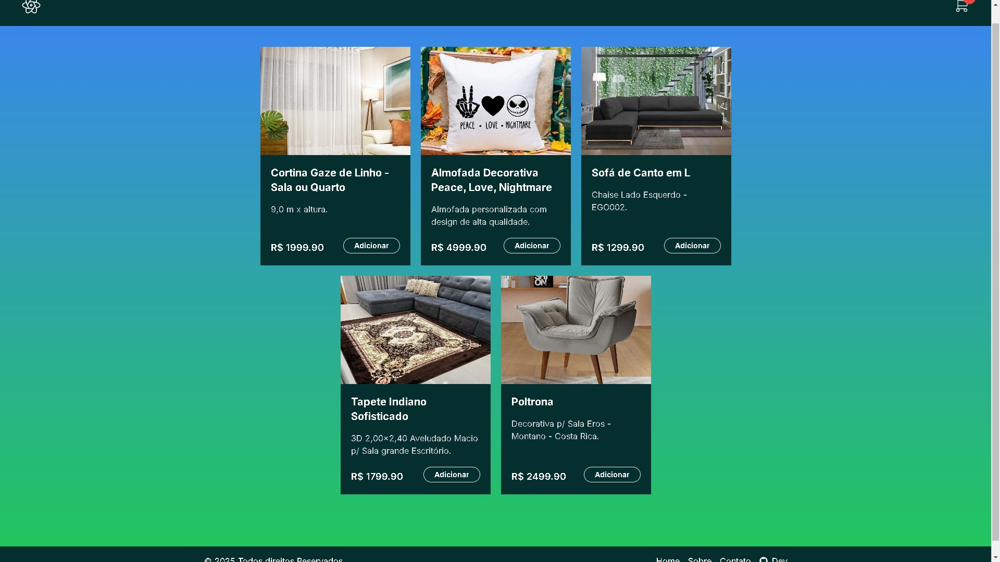

This is a [Next.js](https://nextjs.org/) project bootstrapped with [`create-next-app`](https://github.com/vercel/next.js/tree/canary/packages/create-next-app).
Esse é um [Next.js](https://nextjs.org/) projeto inicializado com [`create-next-app`](https://github.com/vercel/next.js/tree/canary/packages/create-next-app).

## Imagens Project || Imagens do Projeto 📸


## Getting Started || Iniciando o projeto

First, run the development server:
Primeiro, execute o servidor de desenvolvimento:

```bash
npm run dev
# or
yarn dev
# or
pnpm dev
# or
bun dev
```

Open [http://localhost:3000](http://localhost:3000) with your browser to see the result.
Abra [http://localhost:3000](http://localhost:3000) com seu navegador para ver o resultado.

You can start editing the page by modifying `app/page.tsx`. The page auto-updates as you edit the file.
Você pode começar a editar a página modificando `app/page.tsx`. A página é atualizada automaticamente conforme você edita o arquivo.

This project uses [`next/font`](https://nextjs.org/docs/basic-features/font-optimization) to automatically optimize and load Inter, a custom Google Font.
Este projeto usa [`next/font`](https://nextjs.org/docs/basic-features/font-optimization) para otimizar e carregar automaticamente o Inter, uma fonte personalizada do Google.

## Learn More || Saber mais

To learn more about Next.js, take a look at the following resources:
Para saber mais sobre Next.js, dê uma olhada nos seguintes recursos:

- [Next.js Documentation](https://nextjs.org/docs) - learn about Next.js features and API.
- [Learn Next.js](https://nextjs.org/learn) - an interactive Next.js tutorial.
- [Documentação do Next.js](https://nextjs.org/docs) - aprenda sobre os recursos e a API do Next.js.
- [Aprenda Next.js](https://nextjs.org/learn) - um tutorial interativo de Next.js.

You can check out [the Next.js GitHub repository](https://github.com/vercel/next.js/) - your feedback and contributions are welcome!
Você pode conferir [o repositório Next.js GitHub](https://github.com/vercel/next.js/) - seus comentários e contribuições são bem-vindos!

## Deploy on Vercel || Deploy no Vercel

The easiest way to deploy your Next.js app is to use the [Vercel Platform](https://vercel.com/new?utm_medium=default-template&filter=next.js&utm_source=create-next-app&utm_campaign=create-next-app-readme) from the creators of Next.js.

A maneira mais fácil de implantar seu aplicativo Next.js é usar o [Vercel Platform](https://vercel.com/new?utm_medium=default-template&filter=next.js&utm_source=create-next-app&utm_campaign=create-next-app-readme) dos criadores do Next.js.


Check out our [Next.js deployment documentation](https://nextjs.org/docs/deployment) for more details.
Confira nossa [documentação de implantação do Next.js](https://nextjs.org/docs/deployment) para mais detalhes.
